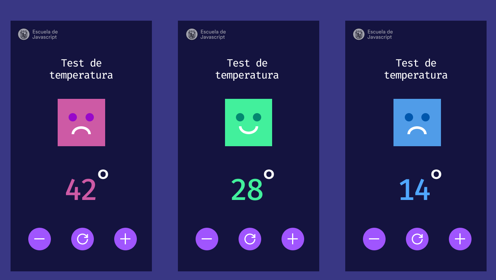
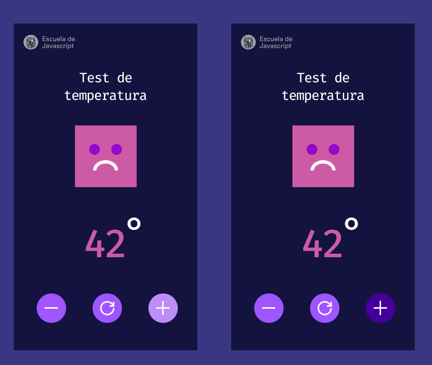

# Test de temperatura
En este pequeño ejemplo podemos subir y bajar la temperatura cambiando el estado de ánimo de nuestro personaje geométrico. Dejo captura de pantalla para que puedas usarlo o cambiarlo a tu gusto.

DEMO
 

 

## 🚀 Instalación
1. Utiliza el comando `git clone` para clonar el proyecto
2. Accede a la carpeta del proyecto `cd temperatura`
3. Abre el proyecto desde editor de código. Puedes descargar el plugin `Five Server` en Visual Studio Code para correr el proyecto.

## 🍩 Contenido　
Nuestra aplicación nos pide cambiar un personaje, en este caso una cara geométrica que cambia de estado.

Nuestro plan:
1. Será crear un evento para los botones de control de subir y bajar la temperatura.
2. Este evento también debe cambiar nuestro personajes. Para hacerlo interesante lo haremos con CSS. Por lo que cambiará las propiedades de CSS de nuestro personaje.

## 🔓 License
The MIT License (MIT)